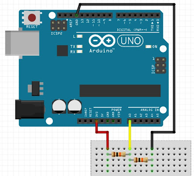

# Voltage Measurement Logger
Ein kleines Tool zum kontinuirliches betrachten von eingehenden Spannungen.

Ist noch im Anfangsstadium der Entwicklung. Kann aber schon verwendet werden, um eingehende Spannungen am Arduino zu messen.

## Benötigt
* Arduino
* Breadboard
* 2x 10kOhm Widerstände
* 3x Jumper Kabel
* Eine Anwendung, mit der man die Messungen loggen kann

## Hinweis!
Maximal kann eine Spannung von 10 Volt gemessen werden. Mehr ist möglich, wenn entsprechend der Spannungsteiler für die Zielbedingung ausgelegt wird.

## Konfigurieren - Simple Voltage Measurement
Zum einfachen Kalibrieren muss zunächst die Messung an dem Arduino 5V Pin erfolgen. Hier im Bild das rote Kabel.

Anschließend den Arduino mit dem PC verbinden und die Consolen Anwendung SimpleVoltageMeasurement starten.

In der Consolenen Anwendung sollten alle verfügbaren Seriellen Ports gelistet werden. Die Nummer vor dem Port ist der Index mit dem dann die Auswahl des Ports ermöglicht wird.
Nach der Auswahl sollte nun die Messung gestartet sein. Der Rohwert müsst ihr nun übernehmen und im Member '_divisorValue' eintragen.

Im Anschluss kann die Consolen Anwendung gestartet werden und mit der eigentlichen Ziel Messung gestartet werden.

## Konfigurieren - Voltage Measurement Logger
Für das Kalibrieren muss ebenfalls an den Arduino 5V PIN angeschlossen werden.

Die Anwendung kann bereits gestartet werden, egal ob der Arduino angeschlossen ist oder nicht. Denn in der Anwendung selbst ist der Button 'R' für Refresh und aktualisiert die Liste angeschlossener Seriellen Ports.
Nach Auswahl des Ports kann die Serielle Verbindung zum Arduino hergestellt werden mit dem Button 'Connect'.

Auf dem Monitor sollte sich nun sich ein Ergebnis zeigen lassen. Wenn der Rohwert bei '0' liegt, dann die Verbindung trennen über den Button 'Disconnect' erneut auf den Button 'Connect'.
Wenn ein Wert ersichtlich ist, dann sollte zum Kalibriren auf den Button 'Set divisor' geklickt werden und dann kann schon mit der eigentlichen Messungen begonnen werden.